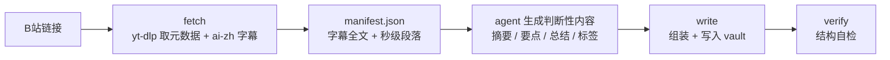

# bilibili-note

> 把 B站视频链接变成 Obsidian 结构化笔记的 [DeepSeek Harness](https://github.com/deepseek-ai) skill。
> **只拉字幕，绝不下载视频。**

[](https://github.com/OWNER/bilibili-note/actions/workflows/ci.yml)
[](LICENSE)
[](https://www.python.org/)

---

## 它解决什么

把一条 B站视频链接固化成 vault 里的结构化笔记。反复执行的机械环节交给脚本，
需要判断的内容交给 agent，两边不混：



| 环节 | 谁做 | 怎么保证可复现 |
|------|------|----------------|
| 下载、解析、格式化、落盘、自检 | 脚本 | 命令与参数写死 |
| 一句话摘要、核心要点、总结、标签 | agent | SKILL.md 里的输入输出规约 |

**它不做什么**：不写逆向/爬虫代码（下载只走 yt-dlp），不碰签名算法与私有接口，
不下载视频或音频，字幕缺失时跳过而不是硬造内容。

---

## 安装

仓库本身就是 skill 目录，复制到 dsh 的用户 skill 路径即可。无构建、无第三方依赖。

```bash
# Linux / macOS / Git Bash
git clone https://github.com/OWNER/bilibili-note.git
mkdir -p ~/.agents/skills
cp -r bilibili-note ~/.agents/skills/
```

```powershell
# Windows PowerShell
git clone https://github.com/OWNER/bilibili-note.git
Copy-Item -Recurse -Force .\bilibili-note "$env:USERPROFILE\.agents\skills\bilibili-note"
```

或用仓库里的安装脚本（自动跳过测试与缓存目录）：

```bash
python scripts/install.py            # 装到 ~/.agents/skills/bilibili-note
python scripts/install.py --dry-run  # 只看会复制什么
```

装好后 dsh 会把它列进 skill 目录，用「B站笔记」之类的触发词即可唤起。

### 前置条件

| 依赖 | 说明 |
|------|------|
| `yt-dlp` | **唯一允许的下载通道**。`pip install -U yt-dlp` |
| B站登录 cookie | AI 字幕需要登录态，见下节 |
| Python 3.8+ | 只用标准库 |

---

## 配置 cookie（必做）

B站的 AI 字幕接口需要登录态，所以必须先导出 cookie：

1. 浏览器安装扩展 **Get cookies.txt LOCALLY**
2. 打开并登录 [bilibili.com](https://www.bilibili.com)
3. 点扩展图标 → Export → 导出 `cookies.txt`
4. 放到**当前工作目录**，或用环境变量指定：

```bash
export BILI_COOKIES=/path/to/cookies.txt     # Linux / macOS
$env:BILI_COOKIES = "C:\path\cookies.txt"    # PowerShell
```

> 只有 UP 主自行上传了字幕的视频才能跳过这一步。

### ⚠️ 为什么不能把导出文件直接喂给 yt-dlp

这是本仓库最值得知道的一个坑。该扩展导出的行长这样：

```
.bilibili.com	FALSE	/	FALSE	1819635894	SESSDATA	xxxxx
```

domain 带前导点 `.`，但第 2 列的 host-only 标志是 `FALSE`。Python 的
`http.cookiejar` 内部有一条断言：

```python
assert domain_specified == initial_dot
```

两者不一致 → 抛 `LoadError` → yt-dlp 直接拒绝加载整个文件：

```
ERROR: invalid Netscape format cookies file '...': '.bilibili.com\tFALSE\t/...'
```

结果是**字幕永远拿不到，而报错看起来像"这个视频没有字幕"**。
解法是归一化：去掉 domain 前导点并把标志置为 `FALSE`（host-only cookie
仍然会发给 `api.bilibili.com` 等子域，登录态不丢）。`bili_note.py` 的
`normalize_cookies()` 做的就是这个，附带过滤出 bilibili 域（导出文件通常混有
其他站点的 cookie）和按 domain/path/name 去重。

---

## 输出目录

脚本不内置任何默认库路径——不同机器的 vault 位置不同，硬编码一个"看起来对"的
路径只会在别处静默创建出空目录。二选一：

```bash
# 方式一：显式传参
python scripts/bili_note.py write --work ./work --note-dir "<vault>/Sources/Videos"

# 方式二：环境变量
export BILI_VAULT="/path/to/MyVault"
export BILI_TARGET_DIR="Sources/Videos"      # 可选，默认值
```

---

## 用法

```bash
# 1. 取元数据 + 字幕（只拉字幕，不拉视频）
python scripts/bili_note.py fetch "https://www.bilibili.com/video/BVxxxxxxxxx" --out ./work

# 2. agent 读 work/manifest.json 生成判断性内容，写成 summary.json

# 3. 组装并写入笔记（不给 --summary-file 则产出草稿）
python scripts/bili_note.py write \
    --work ./work \
    --note-dir "<vault>/Sources/Videos" \
    --summary-file summary.json \
    --processed "<vault>/Sources/Videos/.processed.json"

# 4. 结构自检
python scripts/bili_note.py verify --note "<笔记路径>"
```

`fetch` 会打印每个环节的结果：

```
✓ cookie 归一化：…（33 条 bilibili 域 cookie）
✓ 元数据：视频标题（UP主）｜时长 12:34
  可用字幕语言：danmaku, ai-zh, ai-en
✓ 字幕：ai-zh，134 段，1625 字
✓ manifest：/path/to/work/manifest.json
```

### summary.json 的形状

```json
{
  "summary": "一句话摘要（60-120 字，结论前置）",
  "body": "总结正文（200-400 字，讲清论证链条与结论）",
  "tags": ["认知", "人文"],
  "cards": ["CC_示例"],
  "bullets": [
    {"time": 0,  "title": "小标题", "text": "一句话说明"},
    {"time": 23, "title": "小标题", "text": "一句话说明"}
  ]
}
```

`time` 填**秒数**，脚本负责渲染成 `MM:SS` 和跳转链接。`title` 和 `cards` 可省略。

---

## 产出的笔记长什么样

```markdown
---
title: 视频标题
source: https://www.bilibili.com/video/BVxxxxxxxxx
author: UP主
captured: 2026-01-01
duration: "12:34"
type: video-note
status: completed
needs_summary: false
tags: ["认知", "人文"]
---
> [!info] 视频信息
> **UP主**：UP主 ｜ **时长**：12:34 ｜ [原视频](https://www.bilibili.com/video/BVxxxxxxxxx)

## 一句话摘要

……

## 核心要点

|- [00:00](https://www.bilibili.com/video/BVxxxxxxxxx/?t=0s) **小标题**：说明
|- [00:23](https://www.bilibili.com/video/BVxxxxxxxxx/?t=23s) **小标题**：说明

## 总结

……

## 笔记标签

认知 ｜ 人文

## 相关卡片

- [[CC_示例]]

## 原始字幕

> [!quote]- 完整字幕（点击展开）
> ……（已清理时间码与序号的纯文本）
```

> 要点行的 `|- ` 行首看着像坏掉的表格，但它是**故意的**——下游归档管线的校验器
> 只认这个形状。原因和全部格式约定见 [docs/FORMAT.md](docs/FORMAT.md)。

---

## 测试

无需网络、无需 cookie：

```bash
python -m unittest discover -s tests -v
```

42 个测试，覆盖 SRT 解析与时间戳清理（含 LF/CRLF/BOM、多行 cue、超 1 小时、
HTML 与 ASS 标签、含 `<` `>` 的正文、零宽字符、重复句、空 cue）、两种时间戳
格式化、要点行与下游管线的契约、草稿字面量契约、filter cookie 归一化、
URL 规范化、落盘与去重、`verify` 的正反用例。

CI 在 Linux + Windows × Python 3.8/3.10/3.12 上跑同一套测试，见
[.github/workflows/ci.yml](.github/workflows/ci.yml)。

---

## 已知限制

- **只支持 B站**。yt-dlp 支持的其他站点不在设计范围内。
- **依赖 B站的 AI 字幕**。视频没有字幕（且 UP 主未上传）时跳过，不做语音转写。
  视频若需转写，属另一个工具链，本 skill 刻意不引入 ffmpeg/whisper 依赖。
- **AI 字幕有识别错误**。`ai-zh` 由语音识别产生，常有错字漏字。处理边界是：
  引语照抄识别结果不"顺手改对"、能合理还原的按语义概括而不写成引号引语、
  完全不可解的直接丢弃不猜。详见 SKILL.md §2.6。
- **超 1 小时的要点时间戳**用总分钟数（`[93:31]`），刻意不做小时进位——这是与
  下游管线对齐的结果，不是 bug。
- **要点行标签宽度**以两位数分钟为契约。超过 5999 分钟（约 100 小时）的视频
  会让标签变成 4 位数，超出下游正则的 `[0-9]{2}` 范围。

---

## 贡献

欢迎 issue 和 PR。改格式相关的东西之前请先读 [docs/FORMAT.md](docs/FORMAT.md)，
并确保 `python -m unittest discover -s tests` 仍然全绿——测试套件里
`TestDownstreamContract` 就是拿来钉死这些契约的。

---

## License

[MIT](LICENSE)
